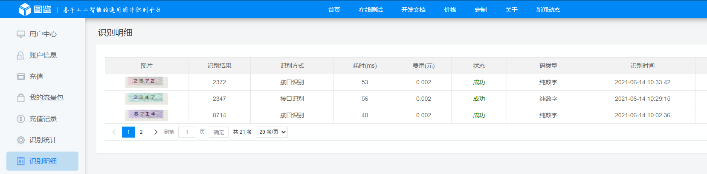

# 广大疫情自动打卡程序
### 广大疫情自动打卡程序；本程序仅供学习使用，不用于任何商业用途。请勿将本程序进行非法使用。大家一定要听从学校组织安排，不要心存侥幸，瞒报自己真实情况妨碍疫情防护，危害他人生命健康。

### 特此声明：如有人使用本程序用于非法用途，均与本人无关。


### 注：本程序使用Python语言所编写，需要进行相应的环境配置。所需要的类库包括有PIL、selenium、selenium、base64、json、requests

selenium需要在本机环境中进行一定的配置，相关的配置可自行百度即可。本程序所使用的是Chromewebdriver（谷歌自动化测试浏览器）

#### Requiremnt

The code was tested on:

- pillow
- selenium
- time
- base64
- json
- requests

To install requirement:

```
pip install -r requirements
```

本程序包括有两个模块，验证码识别模块及相关按钮触发提交模块。

### 使用步骤

**1、打码平台注册**

本平台的验证码模块是使用"图鉴"http://www.ttshitu.com/user/index.html 平台的打码技术，这个平台每次打码所需要的费用是0.002元，充值1元能使用500次。

注册及充值成功后，直接将图鉴平台对应的账户名及密码填写到程序所对应的位置（已经在程序注明位置）

输入注册推荐码会有更多的优惠：

**推荐码：6119962f1e404625b615f9c6c121587f**




**2、填写疫情打卡的平台信息**

以下是广州大学疫情打卡平台的网址：

https://cas.gzhu.edu.cn/cas_server/login;jsessionid=EF79AF3AE0584CE1D3391788B5EC17F9?service=http%3A%2F%2Fyqtb.gzhu.edu.cn%2Finfoplus%2Flogin%3FretUrl%3Dhttp%253A%252F%252Fyqtb.gzhu.edu.cn%252Finfoplus%252Foauth2%252Fauthorize%253Fx_redirected%253Dtrue%2526scope%253Dprofile%252Bprofile_edit%252Bapp%252Btask%252Bprocess%252Bsubmit%252Bprocess_edit%252Btriple%252Bstats%252Bsys_profile%252Bsys_enterprise%252Bsys_triple%252Bsys_stats%252Bsys_entrust%252Bsys_entrust_edit%2526response_type%253Dcode%2526redirect_uri%253Dhttp%25253A%25252F%25252Fyq.gzhu.edu.cn%25252Ftaskcenter%25252Fwall%25252Fendpoint%25253FretUrl%25253Dhttp%2525253A%2525252F%2525252Fyq.gzhu.edu.cn%2525252Ftaskcenter%2525252Fworkflow%2525252Findex%2526client_id%253D1640e2e4-f213-11e3-815d-fa163e9215bb'

将该网址的账户名及密码填写到程序所对应的位置。


**3、执行程序**

本次程序提供两种版本，包括jupterlab(anaconda)版本及.py版本，根据个人情况自行选择版本

（1）配置有python环境，直接双击执行（可能出现报错的情况看不到）

（2）Win+R，输入cmd，跳转到程序所在目录，采用 

 ```
python yiqing-v2.0.py
 ```

（3）在Anaconda下，直接执行代码块

**4、备注**

可能出现错误的情况包括以下情况：

1、本程序验证码的识别采用截图保存到本地的形式，可能存在保存不成功或权限问题。需要根据报错情况对路径或权限进行修改

2、本程序并不是每次都能执行成功，有时候会出现执行失败的情况。可能会出现第一次执行失败，第二次执行成功。哪个步骤执行失败，都有相关的错误提示。

3、可能出现selenium版本错误的问题，这个问题可以自行百度处理，属于常见问题。


## 再次声明：本程序仅供学习使用，并无其他意图，如有非法使用，均与本人无关。


